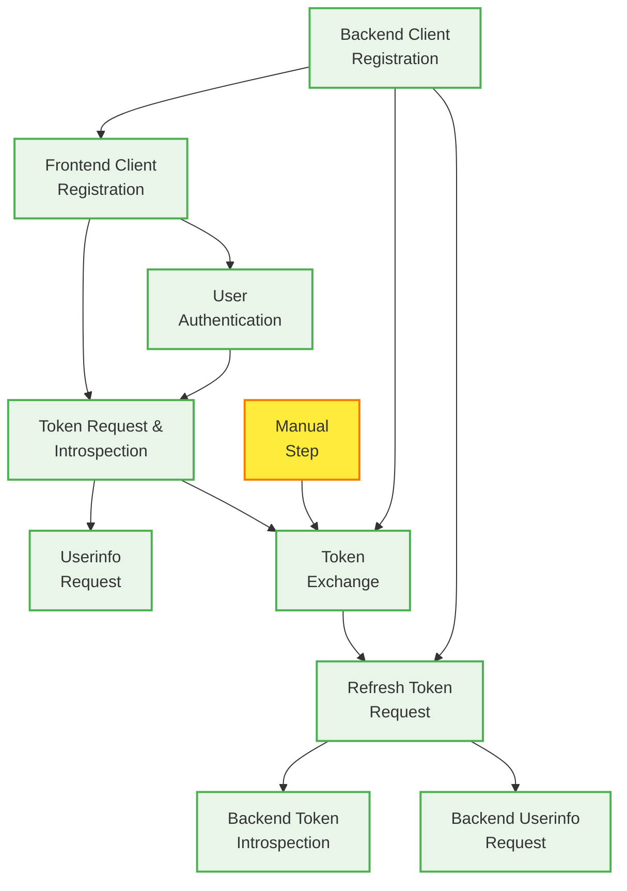
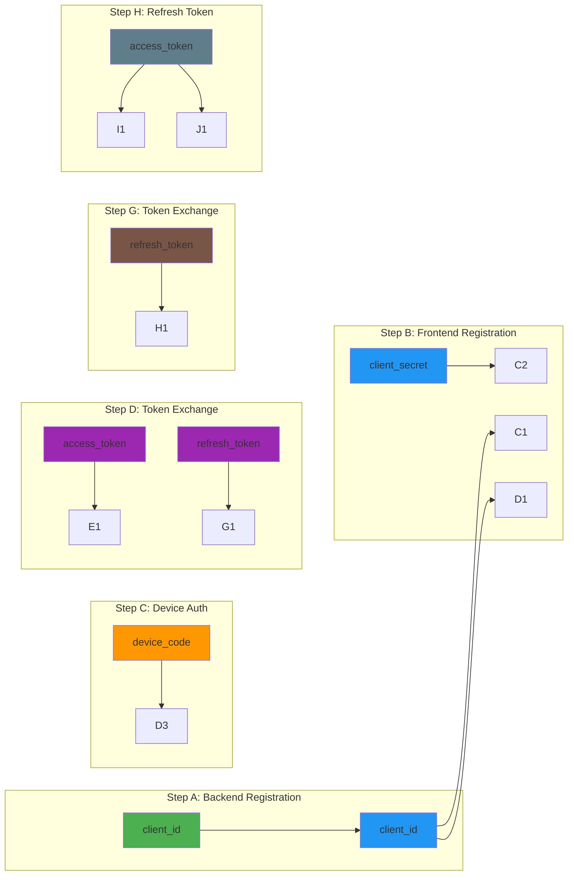

# Streamlit OAuth2 Token Exchange Demo

[](https://github.com/HarryKodden/token-exchange-demo/actions/workflows/image.yml)
[](https://opensource.org/licenses/MIT)
[](https://docker.com)
[](https://kubernetes.io)

This is a Dockerized Streamlit application for demonstrating OAuth2 Token Exchange flows. The application is now **config-driven** for maximum flexibility and maintainability.

## 📋 Configuration-Driven Architecture

The application now uses a `config.yaml` file to define:

- **Steps**: Step definitions, titles, descriptions, and manual flags
- **Dependencies**: Which steps depend on which other steps
- **CURL Templates**: Dynamic curl command templates with endpoint placeholders
- **Substitution Rules**: How to replace placeholders with actual values from previous steps
- **Execution Order**: The sequence in which steps should be executed
- **Endpoint Defaults**: Fallback endpoints when discovery doesn't provide them

## 🔀 Directed Graph Architecture

The core of this application is built around a **directed acyclic graph (DAG)** where each step represents a node, and dependencies represent directed edges. This architecture ensures proper execution order and data flow between OAuth2 operations.

### Graph Structure



### Dependency Resolution

The dependency graph defines the execution flow:

```yaml
dependencies:
  # First step has no dependencies
  a: []

  # Step b depends on step a (needs backend client ID)
  b: [ "a" ]

  # Step c depends on step b (needs frontend client credentials)
  c: [ "b" ]

  # Step d depends on steps b and c (needs frontend client + device code)
  d: [ "b", "c" ]

  # Step e depends on step d (needs access token)
  e: [ "d" ]

  # Step f is manual (no automatic dependencies)
  f: []

  # Step g depends on steps a and d (needs backend client + refresh token)
  # OR step g can depend on step f if f is completed (manual step)
  g: [ "a", "d", "f" ]

  # Step h depends on steps a and g (needs backend client + refresh token from g)
  h: [ "a", "g" ]

  # Step i depends on step h (needs access token from h)
  i: [ "h" ]

  # Step j depends on step h (needs access token from h)
  j: [ "h" ]
```

### Data Flow Through the Graph

Each step produces outputs that become inputs for dependent steps through **substitution rules**:



### Step Execution Flow

1. **Parallel Execution**: Steps with satisfied dependencies can run in parallel
2. **Dependency Checking**: Each step validates all its dependencies are complete before execution
3. **Manual Steps**: Steps marked as `manual: true` require user intervention
4. **Dynamic Substitution**: Placeholders in curl templates are replaced with actual values from completed steps

### Key Benefits of DAG Architecture

- **Clear Data Flow**: Visual representation of how tokens and credentials flow between steps
- **Dependency Management**: Automatic resolution of execution order
- **Flexibility**: Easy to add, remove, or modify steps without code changes
- **Debugging**: Clear visibility into which steps are waiting for dependencies
- **Scalability**: Can handle complex OAuth2 flows with multiple branches and merges

## 🔧 Configuration File Structure

```yaml
steps:
  - id: "a"
    title: "Backend Client Registration"
    description: "Register the backend client with OAuth2 server"
    manual: false

dependencies:
  a: []  # No dependencies
  b: ["a"]  # Depends on step 'a'
  g: ["a", "d", "f"]  # Can depend on multiple steps

curl_templates:
  a: |
    curl -X POST {registration_endpoint}
      -H "Content-Type: application/json"
      -d {{
        "redirect_uris": [],
        "grant_types": ["client_credentials", "refresh_token"]
      }}

substitution_rules:
  b:
    data:
      "<backend-client-id>": "step.a.client_id"
  c:
    auth:
      "<frontend-client-id>": "step.b.client_id"
      "<frontend-client-secret>": "step.b.client_secret"
```

## 🚀 Quick Start

### Using Docker Compose (Recommended)

1. **Build and run the application:**

   ```bash
   docker-compose up --build
   ```

2. **Run in background:**

   ```bash
   docker run -d streamlit-oauth-demo
   ```

3. **Stop the application:**

   ```bash
   docker-compose down
   ```

4. **View logs:**

   ```bash
   docker-compose logs -f
   ```

### Using Kubernetes (Helm)

1. **Prerequisites:**
   - Kubernetes cluster (1.19+)
   - Helm 3.0+
   - Docker Hub access (for pulling images)

2. **Build and push the Docker image:**

   ```bash
   docker build -t harrykodden/token-exchange-demo:latest .
   docker push harrykodden/token-exchange-demo:latest
   ```

3. **Install the Helm chart:**

   ```bash
   # Add your Docker Hub credentials to pull the image
   kubectl create secret docker-registry dockerhub-secret \
     --docker-server=https://index.docker.io/v1/ \
     --docker-username=your-username \
     --docker-password=your-password \
     --docker-email=your-email@example.com

   # Install the application
   helm install token-exchange-demo ./helm/token-exchange-demo
   ```

4. **Access the application:**

   ```bash
   # Port forward to access locally
   kubectl port-forward svc/token-exchange-demo 8501:8501

   # Or create an Ingress for external access
   # Edit helm/token-exchange-demo/values.yaml to enable ingress
   ```

5. **Monitor the deployment:**

   ```bash
   # Check pod status
   kubectl get pods -l app.kubernetes.io/name=token-exchange-demo

   # View logs
   kubectl logs -l app.kubernetes.io/name=token-exchange-demo -f

   # Upgrade the deployment
   helm upgrade token-exchange-demo ./helm/token-exchange-demo
   ```

6. **Uninstall:**

   ```bash
   helm uninstall token-exchange-demo
   ```

## 🎛️ Customizing the Workflow

### Adding New Steps

1. **Add step definition to `config.yaml`:**

   ```yaml
   steps:
     - id: "k"
       title: "Custom Step"
       description: "Your custom OAuth2 step"
       manual: false
   ```

2. **Define dependencies:**

   ```yaml
   dependencies:
     k: ["j"]  # Depends on step 'j'
   ```

3. **Add curl template:**

   ```yaml
   curl_templates:
     k: |
       curl -X POST {token_endpoint}
         -H "Content-Type: application/json"
         -d {{"custom": "data"}}
   ```

4. **Add substitution rules:**

   ```yaml
   substitution_rules:
     k:
       data:
         "<custom-token>": "step.j.access_token"
   ```

### Modifying Existing Steps

- Edit the corresponding sections in `config.yaml`
- The application will automatically pick up changes on restart
- No code changes required!

## 🔍 Debugging

- **Config Loading**: Check console logs for configuration parsing errors
- **Step Dependencies**: Use the debug panel to see step status
- **CURL Generation**: Monitor logs for endpoint resolution
- **Substitution**: Check logs for value replacement operations

### Using Docker directly

1. **Build the image:**

   ```bash
   docker build -t streamlit-oauth-demo .
   ```

2. **Run the container:**

   ```bash
   docker run -p 8501:8501 -v $(pwd):/app streamlit-oauth-demo
   ```

## Access the Application

Once running, access the application at: [http://localhost:8501](http://localhost:8501)

## Development

The docker-compose.yml mounts the current directory, so you can make changes to `streamlit_app.py` and see them reflected immediately (Streamlit has hot reload).

## Configuration

- **Port:** 8501 (configurable in docker-compose.yml)
- **Logs:** Stored in `./logs/` directory
- **Health Check:** Available at `/healthz` endpoint

## Troubleshooting

1. **Port already in use:**

   ```bash
   # Change the port mapping in docker-compose.yml
   ports:
     - "8502:8501"  # Use port 8502 instead
   ```

2. **Permission issues:**

   ```bash
   # Ensure logs directory exists and has proper permissions
   mkdir -p logs
   chmod 755 logs
   ```

3. **Container won't start:**

   ```bash
   # Check logs
   docker-compose logs streamlit-app

   # Rebuild without cache
   docker-compose build --no-cache
   ```

## 🔐 OAuth2 Flow Overview

This application demonstrates a complete OAuth2 ecosystem with the following flows:

### Primary Flows

1. **Device Authorization Grant** (RFC 8628)
   - User authenticates via device code
   - Frontend client obtains access/refresh tokens
   - Demonstrates user interaction flow

2. **Token Exchange** (RFC 8693)
   - Backend service exchanges refresh token for new tokens
   - Shows service-to-service authentication
   - Maintains token freshness without user interaction

3. **Client Credentials Grant** (RFC 6749)
   - Backend and frontend clients register with OAuth server
   - Machine-to-machine authentication

### Complete Token Lifecycle

```mermaid
sequenceDiagram
    participant U as User
    participant F as Frontend Client
    participant B as Backend Service
    participant O as OAuth Server

    Note over U,O: Device Authorization Flow
    F->>O: POST /device/authorize (client_id)
    O-->>F: device_code, user_code, verification_uri
    F-->>U: Display user_code and verification_uri
    U->>O: Visit verification_uri, enter user_code
    O-->>U: Authorization prompt
    U->>O: Grant permission
    F->>O: POST /token (device_code, client_id, client_secret)
    O-->>F: access_token, refresh_token

    Note over B,O: Token Exchange Flow
    B->>O: POST /token (grant_type=token-exchange)
    Note right: subject_token=refresh_token<br/>requested_token_type=refresh_token
    O-->>B: new_refresh_token

    Note over B,O: Refresh Token Flow
    B->>O: POST /token (grant_type=refresh_token)
    O-->>B: new_access_token

    Note over B,O: Token Introspection
    B->>O: POST /introspect (token=access_token)
    O-->>B: token metadata (active, scope, etc.)

    Note over B,O: Userinfo Request
    B->>O: GET /userinfo (Authorization: Bearer)
    O-->>B: user profile information
```

### Security Benefits Demonstrated

- **Token Rotation**: Regular token refresh prevents long-lived token exposure
- **Scope Limitation**: Each client has appropriate scopes for its use case
- **Service Isolation**: Frontend and backend clients have separate credentials
- **User Consent**: Device flow requires explicit user authorization
- **Token Validation**: Introspection ensures token validity before use

### Real-World Use Cases

- **Mobile Applications**: Device authorization flow for mobile apps
- **Microservices**: Token exchange between internal services
- **API Gateways**: Token validation and refresh at the edge
- **Third-Party Integrations**: Secure API access with proper token management
- **IoT Devices**: Device authorization for constrained devices

This implementation showcases enterprise-grade OAuth2 patterns suitable for production applications with proper security, scalability, and maintainability considerations.
